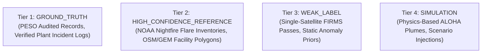

# Data Provenance, Label Quality, & Traceability Framework
**Project**: REACT-X Data Architecture  
**Standards**: ISO 8000 (Data Quality), FAIR Data Principles  

---

## 1. Traceable Data Quality Tiers

Every record in the REACT-X operational, historical, and benchmark datastores is explicitly tagged with one of four immutable quality tiers:



| Quality Tier | Source Integrity | Ingestion Criteria | Usage in REACT-X |
| :--- | :--- | :--- | :--- |
| **`GROUND_TRUTH`** | Verified regulatory records (PESO accident reports, OISD safety committee audits). | Multi-party signed investigation logs with exact time, coordinates, and chemical inventory. | Final model evaluation test sets and critical safety calibration benchmarks. |
| **`HIGH_CONFIDENCE_REFERENCE`**| National spatial datasets (OSM Industrial geometries, Global Energy Monitor infrastructure, VIIRS Nightfire gas flare catalogues). | High-resolution satellite verification, official company disclosures. | Spatial attribution fences, baseline thermal fingerprints, facility profiles. |
| **`WEAK_LABEL`** | Real-time spaceborne feeds (NASA FIRMS NRT CSV streams, automated land cover inference). | Machine-generated spaceborne passes without ground inspection verification. | Dynamic event discovery, prior evidence masses. |
| **`SIMULATION`** | Validated mathematical dispersion models (ALOHA Gaussian/Heavy Gas, Dijkstra shortest safe path). | Physics-based numerical simulators operating with real-time weather inputs. | Downstream impact zone calculation, evacuation route generation, operator drilling. |

---

## 2. Sensor-Time Alignment & Cache Freshness Policies

To prevent stale data from masquerading as real-time information, REACT-X enforces separate time axes and caching TTLs:

| Ingestion Channel | Source Sampling Rate | Server Cache TTL | Stale Threshold | Freshness Evaluation Method |
| :--- | :--- | :--- | :--- | :--- |
| **NASA FIRMS Satellite** | ~12 Hours (Orbit dependent) | `15 Minutes` | `> 6 Hours` | `now_utc - event.acquisition_timestamp` |
| **Plant Edge Telemetry (OPC UA)**| 1.0 Second | `3 Seconds` | `> 15 Seconds` | `now_utc - telemetry.source_timestamp` |
| **PTZ / Thermal Camera** | 1.0 - 5.0 FPS | `2 Seconds` | `> 10 Seconds` | `now_utc - frame.timestamp` |
| **Meteorological Weather (IMD/GFS)**| 15 Minutes | `5 Minutes` | `> 60 Minutes` | `now_utc - weather.observation_time` |
| **High-Res EO (Sentinel-2)** | 5 Days | `24 Hours` | `> 7 Days` | `now_utc - scene.acquisition_timestamp` |

---

## 3. Storage Architecture

```text
[ HOT LAYER (In-Memory / SQLite Active DB) ]
  ├── Current Real-Time Satellite Hotspots (FIRMS NRT)
  ├── Active Incident Workspaces & ALOHA Plumes
  └── Live Telemetry Streams (Last 5 Minutes)

[ WARM LAYER (SQLAlchemy Historical Tables) ]
  ├── Thermal Source Objects & H3 Clustering Registry (30-Day Window)
  ├── Facility Behavioral Baselines (Median, MAD, Fingerprints)
  └── Multi-Satellite Corroboration Bundles

[ COLD LAYER (Auditable Event Log & Parquet Archives) ]
  ├── Audit Trail & Operator Action History
  ├── Immutable Model Calibration Datasets
  └── Historical National Incident Archives
```
