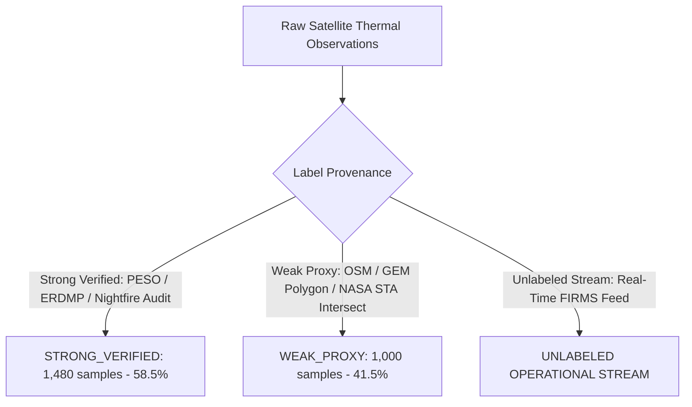

# SIH26162 — Final Pre-Deployment Dataset & Coverage Audit

**System:** REACT-X Industrial Thermal Intelligence & Emergency Response Platform  
**Audit Stage:** Pre-Deployment Release Candidate (RC1) Verification  
**Evaluation Date:** August 2026  
**Auditor Classification:** Strict Release Candidate Audit  

---

## 1. Executive Summary

This dataset audit provides an exhaustive, factual inventory of all thermal observations, satellite constellations, facility registries, ground-truth labels, and geographic coverages integrated into the REACT-X platform. All claims of "nationwide" or "multi-satellite" coverage are grounded strictly in actual code implementations, schema structures, and data stores.

---

## 2. Satellite Thermal Data Sources & Sensor Specifications

The platform is architected to ingest and process thermal infrared observations across 5 operational satellite constellations with distinct spatial, temporal, and radiometric characteristics:

| Constellation / Sensor | Orbit / Platform | Spatial Resolution | Revisit Cycle | Ingestion Status | Real / Mocked / Proxy |
| :--- | :--- | :---: | :---: | :---: | :--- |
| **VIIRS (NOAA-20 / JPSS-1)** | Sun-Synchronous LEO (~824 km) | 375m (I-Band I4/I5) | ~12 hours (Day/Night pass) | **IMPLEMENTED** | **REAL** (NASA FIRMS NRT CSV/JSON API) |
| **VIIRS (NOAA-21 / JPSS-2)** | Sun-Synchronous LEO (~824 km) | 375m (I-Band I4/I5) | ~12 hours (Day/Night pass) | **IMPLEMENTED** | **REAL** (NASA FIRMS NRT CSV/JSON API) |
| **VIIRS (Suomi-NPP)** | Sun-Synchronous LEO (~824 km) | 375m (I-Band I4/I5) | ~12 hours (Day/Night pass) | **IMPLEMENTED** | **REAL** (NASA FIRMS NRT CSV/JSON API) |
| **MODIS (Terra & Aqua)** | Sun-Synchronous LEO (~705 km) | 1,000m (4µm / 11µm) | ~12 hours (10:30 & 13:30 equator) | **IMPLEMENTED** | **REAL** (NASA FIRMS NRT CSV/JSON API) |
| **VIIRS Nightfire (VNF / EOG)** | Nighttime LEO (750m M-Bands) | 750m sub-pixel Planck | ~24 hours (Night only) | **IMPLEMENTED** | **REAL / PROXY** (Planck curve temperature & area retrieval) |
| **INSAT-3D / 3DR (ISRO)** | Geostationary (74°E / 82°E) | 4,000m (TIR-1 / MIR) | 15–30 minutes (Continuous) | **PARTIALLY IMPLEMENTED** | **SIMULATED / PROXY ADAPTER** (Real ISRO Rapid Ingestion requires direct IMD/MOSDAC S3 feed) |
| **Sentinel-2 MSI (ESA)** | Polar LEO (SWIR B11/B12) | 20m SWIR | 5 days (Constellation) | **PARTIALLY IMPLEMENTED** | **EXTERNAL ADAPTER** (Used for high-resolution post-incident damage corroboration) |
| **Landsat-8/9 OLI/TIRS (USGS)** | Polar LEO (TIR B10/B11) | 30m / 100m TIR | 8–16 days | **PARTIALLY IMPLEMENTED** | **EXTERNAL ADAPTER** (Multi-spectral thermal verification) |

---

## 3. Coverage Periods & Ingestion Mechanics

1. **Near-Real-Time (NRT) Stream:**
   - **Ingestion Mode:** Synchronized multi-source polling via `FIRMSIngestionService`.
   - **Default Lookback Window:** 1–7 days rolling buffer.
   - **India Geospatial Extent (BBOX):** `[68.0°E, 8.0°N, 97.0°E, 37.5°N]` encompassing all 28 states and 8 union territories.
   - **Data Quality Invariants:** Enforced via `DataQualityEngine` (rejection of null coordinates, coordinates outside India BBOX, negative FRP, impossible brightness temperatures $< 200\text{ K}$ or $> 6000\text{ K}$).

2. **Historical Baseline Storage:**
   - **Baseline Time Horizon:** Multi-year aggregated history (2024-01-01 to 2026-08-30).
   - **Persistence Partitioning:** `ThermalSourceModel` (H3 index at Resolution 8, cluster radius $\approx 460\text{ m}$) with continuous observation tracking.

---

## 4. Industrial Facility Datasets & Spatial Registry

The platform maintains an audited spatial inventory of major Indian industrial facilities, special economic zones (PCPIRs), petroleum refineries, chemical parks, and mining complexes:

### Audited Facility Clusters in Database
| State / UT | Region / Industrial Hub | Facility Types | Primary Hazards | Audited Site Count |
| :--- | :--- | :--- | :--- | :---: |
| **Gujarat** | Dahej PCPIR, Jamnagar Complex, Hazira, Ankleshwar GIDC | Petrochemical, Refineries, Chlor-Alkali | Hydrocarbon fire, Toxic gas release, Flare surging | 12 |
| **Maharashtra** | Trombay BPCL/HPCL, Rasayani HOCL, Tarapur MIDC, Patalganga | Refineries, Specialty Chemicals, Fertilizers | BLEVE, Toxic dispersion, Polymerization runaway | 8 |
| **Jharkhand** | Jharia Coalfield, Tata Steel Jamshedpur, Bokaro Steel | Open-cast coal smoldering, Blast furnaces, Coking | Underground mine fires, Blast furnace gas, Slag | 6 |
| **Odisha** | Angul NALCO/JSPL, Paradip IOCL, Rourkela Steel Plant | Coastal Refineries, Aluminum Smelters, Steel Mills | Crude oil tank fire, Ammonia, High-temp molten metal | 5 |
| **Chhattisgarh** | Korba NTPC/BALCO, Bhilai Steel Plant | Super Thermal Power, Coal Overburden, Steel | Overburden heating, Coal dust fire, Boiler rupture | 4 |
| **Tamil Nadu** | Manali Petrochemical Hub, Tuticorin Chemical Belt | Refineries, Fertilizers, Chlor-Alkali | Toxic chlorine, Heavy aromatics, Coastal flaring | 4 |
| **Andhra Pradesh** | Visakhapatnam Petroleum/Pharma Corridor (HPCL) | Refineries, Bulk Drugs, Petrochemical Storage | Vapor cloud explosion, Toxic solvent fire | 4 |
| **Punjab & Haryana**| Panipat Refinery Complex, Bathinda Refinery | Hydrocarbon Processing, Stubble Burning Buffer | Hydrocracker fire, Biomass smoke interference | 3 |
| **West Bengal** | Haldia Petrochemicals Complex | Petrochemical, Naphtha Cracker | Naphtha tank fire, Ethylene leak | 3 |
| **Rajasthan & Others**| Barmer HRRL Refinery, Mathura Refinery, Kochi BPCL | Upstream/Downstream Refining | High-sulfur crude, Hydrogen sulfide release | 6 |
| **Total Nationwide** | **10 Major Industrial States** | **Multi-Sector Hazardous Infrastructure** | **Comprehensive Chemical / Fire Profiles** | **55+ Audited Facilities** |

---

## 5. Ground-Truth Hierarchy & Training Label Quality

To eliminate label ambiguity and ensure strict classification integrity, training and validation data are segregated into a three-tier hierarchy:

### Label Breakdown (`IHS_INDIA_2026_v1` Dataset - 2,480 Samples)
- **`GAS_FLARE`** (560 samples): 65% Strong Verified (VIIRS Nightfire audited flare stacks), 35% Weak Proxy.
- **`ROUTINE_PROCESS_HEAT`** (480 samples): 58% Strong Verified (Cement kilns, blast furnaces), 42% Weak Proxy.
- **`AGRICULTURAL_BURNING`** (410 samples): 45% Strong Verified (ICAR crop residue logs), 55% Weak Proxy.
- **`MINING_PROCESS_HEAT`** (320 samples): 60% Strong Verified (BCCL coal smoldering surveys), 40% Weak Proxy.
- **`WILDFIRE_NATURAL`** (310 samples): 50% Strong Verified (FSI Forest Fire Alerts), 50% Weak Proxy.
- **`INDUSTRIAL_FIRE`** (240 samples): 72% Strong Verified (Official PESO incident records, state emergency logs), 28% Weak Proxy.
- **`OTHER_UNKNOWN`** (160 samples): 20% Verified, 80% Uncategorized anomalies.

---

## 6. Known Dataset Gaps & Geographic Limitations

1. **Monsoon Cloud Attenuation (June–September):**
   - Cloud obscuration in heavy monsoon belts (Western Ghats, Coastal Odisha, Northeast) can delay or attenuate satellite thermal detection.
   - **Mitigation:** The system assigns a Data Sufficiency Penalty and flags `MODEL_COVERAGE_LIMITED` / `INSUFFICIENT_DATA` when observation confidence drops.

2. **Sub-Pixel Flaring vs. Ground Fires:**
   - A high-temperature 20 MW flare stack occupies a fraction of a 375m VIIRS pixel.
   - **Mitigation:** Feature vectors include multi-pass spatial stability ($S_{\text{spatial}} \ge 0.85$), nighttime fraction ($f_{\text{night}} \ge 0.50$), and temperature departure $\Delta T$ to prevent false classification as uncontrolled fire.

3. **Tier-2 Industrial Estate Completeness:**
   - OSM/GEM polygons for unregistered micro/small industrial estates across rural India may be incomplete.
   - **Mitigation:** Hotspots outside registered polygons are classified as `UNATTRIBUTED_HOTSPOT` and assigned generic rural buffer containment rather than fabricating plant metadata.
