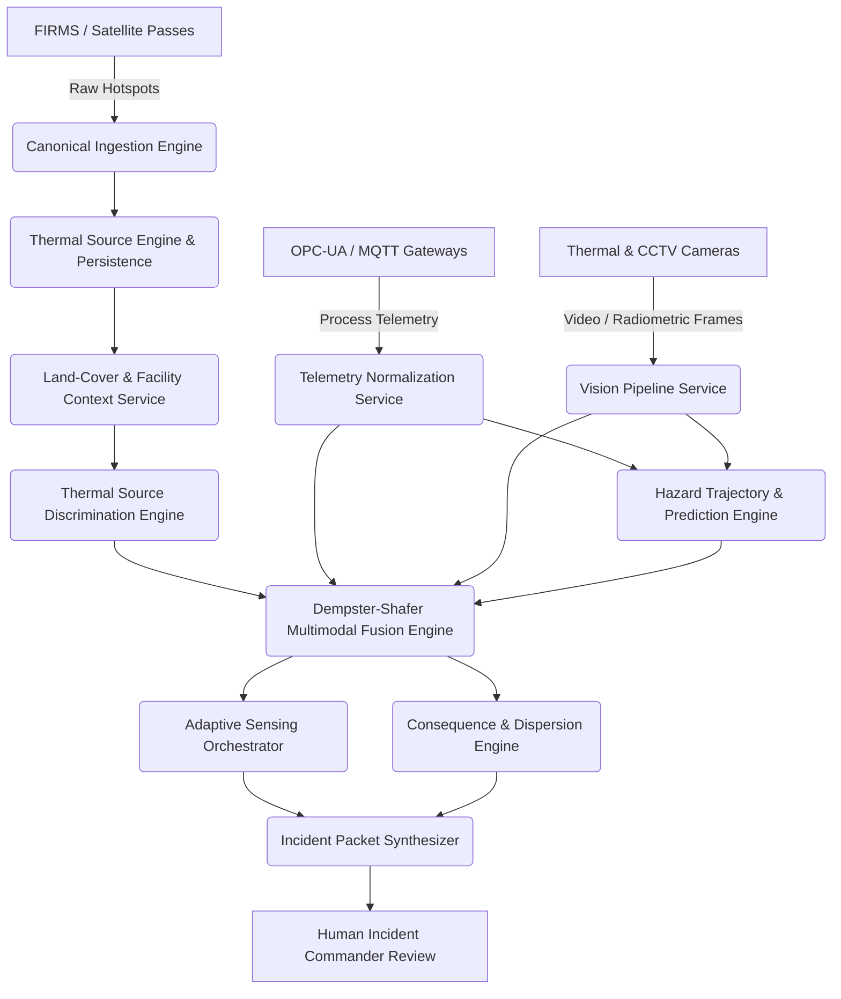

# REACT-X System Dependency Graph & Failure Degradation

**Document Version:** 1.0.0  
**Phase:** 19 — End-to-End System Integration, Connectivity & Operational Orchestration  

---

## 1. System Module Dependency Graph

---

## 2. Graceful Degradation & Failure Modes

| Failed / Disconnected Component | Impact on Pipeline | System Fallback Behavior |
| :--- | :--- | :--- |
| **NASA FIRMS Satellite API Offline** | Satellite context unavailable | Pipeline continues processing local facility telemetry and thermal cameras; flags `SATELLITE_CONTEXT_DEGRADED`. |
| **Facility Process Telemetry Disconnected** | Seconds-horizon telemetry missing | Pipeline relies on wide-area satellite thermal clustering and visual cameras; flags `TELEMETRY_OFFLINE`. |
| **Thermal / Optical CCTV Offline** | Visual confirmation unavailable | Pipeline continues using process telemetry and satellite detections; sets `visual_thermal_state = UNKNOWN`. |
| **Environmental Weather API Offline** | Live wind vector unavailable | Consequence dispersion engine falls back to standard nominal meteorological default ($3.0\,\text{m/s}$, neutral D class) and increases plume uncertainty band. |
| **Database Read Failure** | Historical baseline inaccessible | Pipeline returns `BASELINE_NOT_ESTABLISHED` and abstains from high-confidence predictions (`NEEDS_REVIEW`). |
