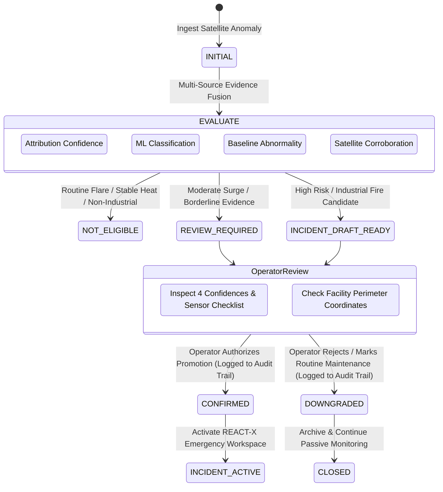

# SIH26162 — Final Evidence Fusion, Industrial Risk Assessment & REACT-X Emergency Integration Architecture

## 1. System Philosophy & Objectives

In **Phase 9**, **SIH26162** (*Industrial Thermal Intelligence & Emergency Response Platform*) synthesizes all underlying analytical models into **one authoritative, explainable, evidence-based assessment engine** (`IndustrialThermalAssessment`).

### Core Design Principles:
1. **NO Single Opaque AI Score**: Rather than collapsing disparate metrics into an arbitrary number, the system maintains **8 independent analytical dimensions**:
   - **Observation** (Raw satellite telemetry from NASA FIRMS & geostationary sensors)
   - **Source Identity** (Spatiotemporal clustering centroid & polygon footprint)
   - **Facility Attribution** (Cadastral polygon intersection & geometric proximity)
   - **Persistence & Behaviour** (Non-parametric empirical baselines)
   - **ML Classification** (7-Class calibrated probability distribution)
   - **Multi-Satellite Evidence** (4-tier sensor specialization & dependency graph)
   - **Industrial Risk** (Multi-factor screening-level consequence assessment)
   - **Emergency Response Status** (Human-authorized handoff to REACT-X)
2. **Four Independent Confidences**:
   - **Facility Attribution Confidence ($S_{\text{attr}}$)**: Spatial and cadastral certainty.
   - **Classification Confidence ($S_{\text{class}}$ / $p$)**: Calibrated ML softmax probability.
   - **Abnormality Confidence ($S_{\text{abn}}$)**: Historical baseline sample sufficiency.
   - **Overall Evidence Confidence ($S_{\text{ev}}$)**: Multi-satellite corroboration & agreement.
3. **Safe Satellite $\to$ REACT-X Emergency Handoff**:
   - **Prohibition of Autonomous Physical Actuation**: Satellite detections **never** autonomously actuate valves, trip Safety Instrumented Systems (SIS), initiate Emergency Shutdowns (ESD), dispatch physical firefighting equipment, or trigger regional sirens without explicit operator review and authorization.
   - **Strict Data Quality Disclosures**: If chemical inventories or site-level worker counts are missing, downstream engines explicitly output `INSUFFICIENT DATA` / `SITE-LEVEL DATA UNAVAILABLE`.

---

## 2. Multi-Factor Screening-Level Industrial Risk Methodology

The system evaluates industrial risk via an explainable, multi-factor formulation:

$$\text{Risk Score} = Q_{\text{gate}} \cdot \Big[ 0.35 \cdot H_{\text{class}} + 0.30 \cdot A_{\text{score}} + 0.20 \cdot I_{\text{frp}} + 0.15 \cdot P_{\text{prox}} \Big]$$

Where:
- **$Q_{\text{gate}}$ (Data Quality & Evidence Gate)**: $\min(S_{\text{attr}}, S_{\text{ev}})$. If attribution or satellite evidence is weak, risk is bounded to screening level.
- **$H_{\text{class}}$ (Hazard Potential $[0 - 100]$)**:
  - `INDUSTRIAL_FIRE`: $95$
  - `GAS_FLARE`: $30$ (if normal), $75$ (if abnormal / unpredicted surge)
  - `ROUTINE_PROCESS_HEAT`: $15$ (if normal), $65$ (if abnormal surge)
  - `MINING_PROCESS_HEAT`: $35$
  - `AGRICULTURAL_BURNING` / `WILDFIRE_NATURAL`: $10$ (Non-industrial context)
  - `OTHER_UNKNOWN`: $25$
- **$A_{\text{score}}$ (Abnormality Magnitude $[0 - 100]$)**:
  - Evaluated from Median Absolute Deviation (MAD) robust Z-score ($Z \ge 4.5 \implies 100$, $Z \ge 3.0 \implies 80$, $Z < 1.0 \implies 10$).
- **$I_{\text{frp}}$ (Thermal Radiative Power $[0 - 100]$)**:
  - $\min(100.0, (\text{FRP}_{\text{MW}} / 80.0) \times 100.0)$.
- **$P_{\text{prox}}$ (Facility Containment & Criticality $[0 - 100]$)**:
  - $90$ inside high-hazard petrochemical perimeters; $40$ within $500\text{m}$; $15$ in open land.

### Screening-Level Risk Categories:
- **NOMINAL** ($0 \le \text{Score} < 18$): Stable routine operations, non-industrial burns.
- **LOW** ($18 \le \text{Score} < 38$): Controlled routine heat, low baseline departure.
- **MODERATE** ($38 \le \text{Score} < 60$): Moderate flaring surge or intermediate abnormality; human monitoring required.
- **HIGH** ($60 \le \text{Score} < 80$): Significant unpredicted thermal surge or classified industrial fire candidate.
- **CRITICAL** ($\ge 80$): Confirmed severe industrial fire with multi-satellite corroboration inside high-hazard facility.

---

## 3. Safe Handoff Pipeline & Decision State Machine

---

## 4. REST API Reference

| HTTP Verb | Path | Description | Response Schema |
|---|---|---|---|
| `GET` | `/api/thermal/sources/{source_id}/assessment` | Retrieve active `IndustrialThermalAssessment` (evaluated on-the-fly if missing). | `IndustrialThermalAssessment` |
| `POST` | `/api/thermal/sources/{source_id}/assess` | Force fresh multi-factor re-evaluation. | `IndustrialThermalAssessment` |
| `GET` | `/api/thermal/assessments` | Query historical assessments with filtering (`risk_level`, `handoff_eligibility`, `status`). | `List[IndustrialThermalAssessment]` |
| `GET` | `/api/thermal/assessments/{assessment_id}` | Retrieve specific assessment version by ID. | `IndustrialThermalAssessment` |
| `GET` | `/api/thermal/assessments/{assessment_id}/history` | Retrieve full lineage version tree for an assessment. | `List[IndustrialThermalAssessment]` |
| `POST` | `/api/thermal/assessments/{assessment_id}/promote-incident` | Operator action: Authorize promotion to active REACT-X incident (audited). | `Dict[str, Any]` |
| `POST` | `/api/thermal/assessments/{assessment_id}/reject-draft` | Operator action: De-escalate / mark as routine operation (audited). | `Dict[str, Any]` |
| `GET` | `/api/thermal/assessments/{assessment_id}/executive-brief` | Synthesize unified situation brief in Markdown. | `AssessmentExecutiveBriefResponse` |

---

## 5. Security & Reproducibility Versioning

Every assessment generated stores explicit algorithm versions to guarantee exact reproducibility:
- `classification_model_version`: `IHS_INDIA_HGB_v1.0`
- `abnormality_algorithm_version`: `TF-LEVEL5-v1.0`
- `attribution_algorithm_version`: `OSM-GEM-H3-v1.0`
- `evidence_fusion_version`: `EFE-4TIER-v1.0`
- `risk_algorithm_version`: `MFR-SCREENING-v1.0`

Every operator decision is permanently committed to `DecisionAuditModel` (`decision_audit_trail` table) recording:
- `WHO`: Operator Username & Authenticated Role (`actor_name`, `actor_role`).
- `DID WHAT`: Human Action (`PROMOTED_TO_ACTIVE_INCIDENT` / `REJECTED_DRAFT_INCIDENT`).
- `WHEN`: High-precision UTC timestamp.
- `BASED ON WHICH EVIDENCE`: Full assessment ID & input summary.
- `JUSTIFICATION`: Mandatory operator rationale.
