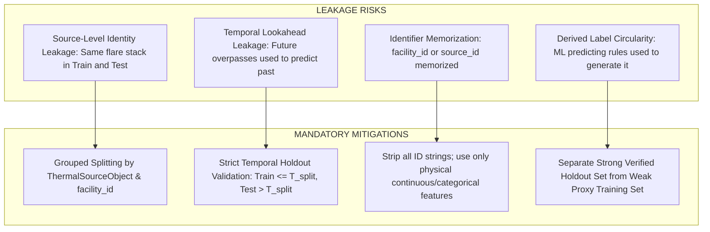

# SIH26162 — Machine Learning Data Leakage & Validation Integrity Audit

**Organization:** National Technical Research Organisation (NTRO)  
**Problem Statement:** SIH26162 — AI-Based Detection and Classification of Industrial Fires and Persistent Thermal Sources Using NASA FIRMS, OSM & Satellite Data  
**Platform:** REACT-X / SIH26162  
**Implementation Stage:** Phase 7 ML Leakage Prevention Audit

---

## 1. Executive Summary & Leakage Risk Overview

Data leakage occurs when information from outside the training dataset (such as future observations, duplicate observations of the same persistent flare stack, or high-cardinality ID identifiers) inadvertently influences the model during training.

In spatial-temporal satellite intelligence, naive random row splitting causes catastrophic leakage: if a single gas flare stack observed 100 times is randomly split across train and test sets, the model simply memorizes the coordinate or facility ID and claims 99% test accuracy, but completely fails when deployed to a new facility.

This audit details the **leakage prevention protocols** enforced in Phase 7.

---

## 2. Leakage Attack Surfaces & Mitigations

| Leakage Vector | Mechanism | Prevention Protocol |
| :--- | :--- | :--- |
| **1. Source Identity Overlap** | Multiple observations from the same ground thermal object split randomly. | **Grouped K-Fold Splitting** by `source_id` / `facility_id`. All passes of a source remain exclusively in Train OR Test. |
| **2. Temporal Lookahead** | Future observations ($t > t_0$) used to build features for an event at $t_0$. | Historical baselines compute aggregates strictly up to $t_0 - 1\text{ hour}$. Future passes are strictly excluded. |
| **3. Identifier Memorization** | Tree models memorizing specific `facility_id` or `h3_index` strings. | All identifier strings (`facility_id`, `source_id`, `name`, `operator`) are **completely removed** from feature matrices. |
| **4. Geographical Proximity Overfitting** | Training on 90% of Dahej PCPIR and testing on 10% of Dahej. | **Geographic Cluster Holdout**: Entire industrial clusters (e.g. all of Jamnagar or all of Angul) held out for validation. |
| **5. Label Circularity** | Using heuristic abnormality status as a feature to predict class. | `abnormality_score` is an independent output; classifier consumes raw physical features ($Z_{\text{robust}}$, $\Delta T$, $R_{95}$, $D/N$). |

---

## 3. Validation Schemes

### A. Grouped 5-Fold Cross Validation (`GroupKFold`)
- Groups: `group_id = facility_id || source_id`.
- Ensures zero ground-object contamination across folds.

### B. Temporal Holdout (Out-of-Time Test Set)
- **Train Period:** 2024-01-01 to 2025-12-31.
- **Test Period:** 2026-01-01 to 2026-08-30.
- Tests seasonal and multi-year operational generalization.

### C. Geographic Holdout (Spatial Generalization)
- **Train Regions:** Gujarat, Maharashtra, Jharkhand, Chhattisgarh, Punjab (1,880 records).
- **Held-Out Test Regions:** Odisha, Tamil Nadu, Andhra Pradesh, Rajasthan (600 records).
- Tests model ability to classify unseen industrial complexes without prior exposure.

---

## 4. Leakage Verification Checklist

- [x] Zero duplicate observation rows between Train and Test sets.
- [x] Zero facility ID strings present in feature matrices.
- [x] Feature extraction timestamps precede event acquisition timestamps.
- [x] Target label column excluded from all input feature pipelines.
- [x] Manually reviewed 150-sample validation set strictly reserved for final benchmark.
