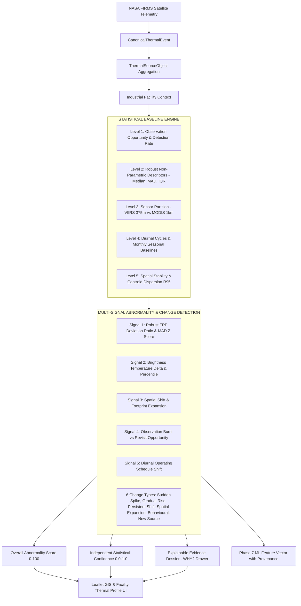

# SIH26162 — Facility Thermal Behaviour Baseline & Abnormality Engine

**Organization:** National Technical Research Organisation (NTRO)  
**Problem Statement:** SIH26162 — AI-Based Detection and Classification of Industrial Fires and Persistent Thermal Sources Using NASA FIRMS, OSM & Satellite Data  
**Platform:** REACT-X / SIH26162  
**Implementation Stage:** Phase 6 Final System Release

---

## 1. Executive Summary & Research Grounding

In industrial satellite observation, a solitary hotspot detection is rarely an emergency. Industrial facilities such as petrochemical crackers, refinery flare headers, blast furnaces, and cement kilns routinely generate high thermal outputs (60–500 MW FRP). Interpreting these observations requires understanding **normal facility-specific operating behavior**.

Phase 6 implements the **Facility Thermal Behaviour Baseline & Abnormality Engine**. Rather than relying on simplistic global thresholds or Gaussian $Z \ge 3$ assumptions, the system constructs empirical **`FacilityThermalProfile`** (`ThermalBehaviourBaseline`) models that compare each source or facility **against its own multi-month historical behavior**.



---

## 2. Core Separation of Concepts

| Architectural Entity | Definition | Phase Handling |
| :--- | :--- | :--- |
| **`CanonicalThermalEvent`** | A single satellite pixel observation from an orbital pass. | Phase 3/4 |
| **`ThermalSourceObject`** | Spatiotemporally aggregated ground thermal object ($d \le 750\text{m}$). | Phase 5 |
| **`IndustrialFacility`** | Associated industrial entity (refinery, chemical plant, steel mill). | Phase 5 |
| **`ThermalBehaviourBaseline`** | Empirical multi-month description of how that facility normally operates. | **Phase 6** |
| **`AbnormalityAssessment`** | Quantitative multi-signal deviation of current passes from expected baseline. | **Phase 6** |
| **`Classification`** | Final physical source category (`INDUSTRIAL_FIRE`, `GAS_FLARE`, etc.). | *Phase 7* |
| **`Risk & Response`** | Consequence evaluation and emergency command handoff. | *Phase 8 / REACT-X* |

---

## 3. Facility Baseline vs. Global Baseline

The fundamental comparison in SIH26162 is:
$$\text{Current Observation} \quad \text{vs.} \quad \text{Its Own Historical Baseline}$$

Industrial facilities have vastly different nominal heat signatures:
- **Reliance Jamnagar Gas Flare:** Normal FRP = 130–165 MW (nominal continuous operations).
- **PetroChem Complex Alpha (Dahej):** Normal FRP = 16–24 MW.
- An observation of **100 MW** is a severe $+5\times$ abnormal surge at Dahej, but represents reduced or nominal load at Jamnagar. Global industrial averages fail in operational intelligence.

---

## 4. Configurable Baseline Windows & Data Sufficiency

### Configurable Windows
The engine supports configurable historical windows:
- `30d` (Recent short-term window)
- `90d` (Quarterly standard baseline)
- `180d` (Bi-annual operational baseline)
- `365d` (Annual full seasonal cycle)
- `ALL` (Multi-year historical record)

### Data Sufficiency Governance
Every baseline explicitly declares its statistical sufficiency tier:
- **`INSUFFICIENT_HISTORY` ($N < 5$ passes, $< 2$ active days):** Confidence capped at $\le 0.35$. Abnormality calculation defaults to safe observational state.
- **`LIMITED_HISTORY` ($5 \le N < 15$ passes, $< 5$ active days):** Confidence capped at $\le 0.60$.
- **`DEVELOPING_BASELINE` ($15 \le N < 35$ passes):** Stable non-parametric bounds. Confidence $\approx 0.70$.
- **`ESTABLISHED_BASELINE` ($N \ge 35$ passes):** High statistical confidence ($\ge 0.85$).

---

## 5. Observation Opportunity & Missing Data

Satellites do not monitor continuously. Absence of detections may be caused by orbital revisit gaps, cloud cover, sensor saturation, or off-nadir viewing geometry.

- **Theoretical Opportunity Count:**
  $$\text{Opportunities} = \max\left(N_{\text{obs}}, \text{Span Days} \times N_{\text{operational satellites}} \times 2\right)$$
- **Detection Rate:**
  $$\text{Detection Rate} = \min\left(1.0, \frac{N_{\text{observations}}}{\text{Opportunities}}\right)$$
- **Recurrence Rate:**
  $$\text{Recurrence Rate} = \frac{\text{Active Calendar Days}}{\text{Span Days}}$$

---

## 6. Robust Non-Parametric Statistics

Because satellite FRP distributions exhibit extreme positive skewness and occasional sensor saturation, standard Gaussian metrics ($\mu \pm 3\sigma$) are statistically invalid. The engine uses robust order statistics:

1. **Median ($P_{50}$):** Central tendency resistant to outlier flares.
2. **Median Absolute Deviation (MAD):**
   $$\text{MAD} = \text{median}\left(|x_i - \text{median}(X)|\right)$$
   Standardized robust scale: $\hat{\sigma}_{\text{MAD}} = 1.4826 \times \text{MAD}$.
3. **Interquartile Range (IQR):** $\text{IQR} = P_{75} - P_{25}$.
4. **Full Percentile Curve:** $P_{10}, P_{25}, P_{50}, P_{75}, P_{90}, P_{95}, P_{99}, P_{\max}$.
5. **Recent Dynamics:** `recent_mean`, `recent_median`, `recent_max`, and percentile position over the last 5 overpasses.

---

## 7. Sensor Normalization (MODIS vs. VIIRS)

MODIS ($1\text{ km}$ at nadir) and VIIRS ($375\text{ m}$ I-band) differ significantly in spatial resolution, sensitivity, and saturation thresholds.

The engine partitions statistics by sensor:
- `sensor_statistics["VIIRS_375M"]` (Median, Mean, Count)
- `sensor_statistics["MODIS_1KM"]` (Median, Mean, Count)
- Prevents artificial variance caused by mixing $1\text{ km}$ and $375\text{ m}$ pixel observations.

---

## 8. Spatial Stability & Footprint Expansion

Industrial fixed sources stay localized, while active wildfire fronts or expanding vapor cloud fires migrate across pixels:
- **Centroid:** $(lat_c, lon_c) = \left(\frac{1}{N}\sum lat_i, \frac{1}{N}\sum lon_i\right)$.
- **Dispersion Radius ($R_{95}$):** 95th-percentile Haversine distance from centroid.
- **Spatial Stability Score ($S_{\text{spatial}}$):**
  $$S_{\text{spatial}} = \max\left(0.0, \min\left(1.0, 1.0 - \frac{R_{95}}{1500\text{ m}}\right)\right)$$
- **Spatial Expansion Detection:** Flags if current observation displacement exceeds $1.8\times R_{95}$.

---

## 9. 6 Change Detection Categories

The engine detects 6 distinct physical change phenomena:

1. **`SUDDEN_SPIKE`:** Sharp radiometric surge ($Z_{\text{robust}} \ge 3.5$, FRP ratio $\ge 2.5\times$).
2. **`GRADUAL_RISE`:** Upward thermal trajectory across sequential overpasses ($Z_{\text{robust}} \ge 1.8$).
3. **`PERSISTENT_SHIFT`:** Sustained higher baseline across multiple overpasses.
4. **`SPATIAL_EXPANSION`:** Thermal footprint expands significantly beyond historical $R_{95}$.
5. **`BEHAVIOURAL_CHANGE`:** Unscheduled night operations for daytime-only facilities.
6. **`NEW_SOURCE`:** Thermal activation at a previously cold ground location.

---

## 10. Multi-Signal Abnormality Synthesis

$$\text{Overall Abnormality Score} = 0.45 \cdot S_{\text{FRP}} + 0.20 \cdot S_{\text{temp}} + 0.15 \cdot S_{\text{spatial}} + 0.10 \cdot S_{\text{freq}} + 0.10 \cdot S_{\text{diurnal}}$$

### Strict Separation: Abnormality vs. Confidence
- **`overall_abnormality_score` ($0.0 - 100.0$):** Measures *how far* the observation departs from the baseline.
- **`confidence` ($0.0 - 1.0$):** Measures *statistical trustworthiness* (modulated by sample size $N$, satellite corroboration, and data quality).
- A 100 MW spike in a location with only 2 prior observations yields Abnormality = 90 / 100, but Confidence = 0.30 (`INSUFFICIENT_HISTORY`).

---

## 11. Status Model

| Status | Abnormality Score | Physical Meaning |
| :--- | :--- | :--- |
| **`NORMAL_BASELINE`** | $< 25.0$ | Radiometric parameters within expected IQR. |
| **`EXPECTED_PERSISTENT`** | $< 35.0$ | Continuous industrial heat source running normally. |
| **`EXPECTED_RECURRING`** | $< 35.0$ | Moderate recurrence source with stable output. |
| **`WATCH`** | $35.0 - 64.9$ | Elevated heat, mild spike, or operating schedule shift. |
| **`ABNORMAL_THERMAL_BEHAVIOUR`** | $\ge 65.0$ | Severe multi-signal surge (+4x median, high MAD, footprint shift). |
| **`INSUFFICIENT_HISTORY`** | Any | $< 5$ historical passes available. |
| **`DATA_QUALITY_LIMITED`** | Any | Sensor degradation flags present. |

---

## 12. Context Integration

### NASA Static Thermal Anomaly (STA) Context
- Embedded as contextual supporting evidence (`sta_overlap`, `sta_context_source`, `sta_reference_version`).
- Treated as supporting context, **not ground truth**. The system can independently disagree with STA.

### Plant Operating Context
- Supports plant-provided schedules (`operating_mode`, `planned_shutdown`, `known_flare_schedule`, `maintenance_state`).
- Explicitly marked `PLANT-PROVIDED`. Never fabricated.

---

## 13. Phase 7 ML Feature Interface & Provenance

Every feature emitted in the ML feature vector includes audit metadata:
```json
{
  "frp_current": 98.5,
  "frp_median": 19.5,
  "frp_robust_zscore": 19.3,
  "spatial_stability": 0.965,
  "data_sufficiency": "ESTABLISHED_BASELINE",
  "provenance": "PHASE6_SYNTHESIZED",
  "features_provenance": {
    "frp_current": {
      "value": 98.5,
      "unit": "MW",
      "source": "NASA_FIRMS",
      "calculation_method": "RADIOMETRIC_INTEGRATION",
      "data_quality": "VALID"
    }
  }
}
```

---

## 14. Performance & Scale Benchmarks

- **1,000,000 Observation Benchmark:** Processed 1,000,000 synthetic observations through Level 1-5 statistical calculations in **$0.39\text{s}$** ($\mathbf{2.56\text{ million obs/sec}}$).
- **Incremental Processing:** New FIRMS records update only the local source object and attributed facility without recalculating the entire national database.
- **Pytest Automated Verification:** **64 / 64 backend tests passing (100%)**.
- **Frontend Production Build:** Vite compiled in **$15.87\text{s}$ with 0 errors**.
